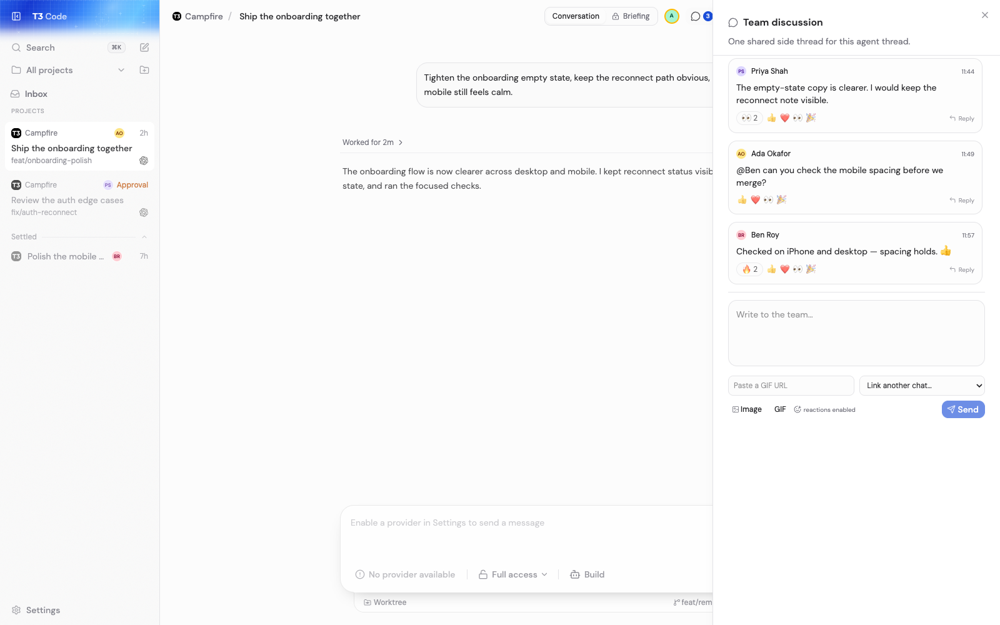

# Campfire

**Run coding agents with your team, not next to them.**

Campfire is an open-source workspace for small, trusted teams running coding agents together across shared projects and machines. It is a deliberately thin, independently maintained fork of [T3 Code](https://github.com/pingdotgg/t3code).

Campfire adds the collaboration primitives our team needed:

- Live presence, typing state, and server-derived teammate attribution
- Durable side conversations attached to agent threads
- Mentions, unread state, notifications, and a team inbox
- Shared controls for long-running, server-owned agent sessions
- A self-hosted Mac mini and Tailscale deployment path

> [!IMPORTANT]
> Campfire is for teams whose members fully trust one another. It has no RBAC,
> tenant isolation, or per-user workspace permissions. Anyone admitted to an
> instance can see and act on shared agent work. If you need isolation between
> users or teams, Campfire is not the right tool.



## Built on T3 Code

Campfire exists because [T3 Code](https://github.com/pingdotgg/t3code) created an excellent open-source foundation for controlling Codex, Claude Code, Cursor, Grok Build, and OpenCode from web, desktop, and mobile clients.

The architecture, provider integrations, remote workflow, core clients, and substantial portions of this repository are the work of [Julius Marminge](https://github.com/juliusmarminge), [Theo Browne](https://github.com/t3dotgg), the T3 Code maintainers, and [upstream contributors](https://github.com/pingdotgg/t3code/graphs/contributors).

We keep Campfire deliberately thin: rebase regularly and before every release, avoid unnecessary renames and rewrites, contribute broadly useful fixes upstream when practical, and keep Campfire-only behavior at narrow boundaries. Campfire is not affiliated with or endorsed by T3 Tools Inc. See [NOTICE.md](./NOTICE.md) and [our upstream policy](./docs/UPSTREAM.md).

## Quick start

Campfire is currently source-first and does not have a stable packaged release. You need Node.js 24.13.1 or newer within major 24 and at least one provider supported by T3 Code already installed and authenticated.

```bash
git clone https://github.com/astraly-labs/campfire.git
cd campfire
corepack enable
corepack pnpm install --frozen-lockfile
corepack pnpm dev
```

Open the pairing URL printed by the development server. Development state stays in the repository's gitignored `.t3` directory.

For provider setup, see the [T3 Code installation guide](https://github.com/pingdotgg/t3code#installation). For a trusted-team deployment with an explicit Google identity allowlist, see the [Campfire Mac mini runbook](./docs/operations/campfire-mac-mini.md).

## Trust model

Campfire authenticates teammates and records who did what; it does not authorize teammates differently. Authentication is not isolation.

Run Campfire on a dedicated host, behind a private network boundary you control, with an explicit identity allowlist. Do not expose it as a shared service between teams or organizations that do not fully trust each other.

Read [SECURITY.md](./SECURITY.md) before deploying it.

## Contributing

Small, focused changes are welcome. Read [CONTRIBUTING.md](./CONTRIBUTING.md) before opening a pull request. Changes that can benefit every T3 Code user should normally be proposed upstream first.

## License

Campfire is distributed under the MIT License inherited from T3 Code. See [LICENSE](./LICENSE) and [NOTICE.md](./NOTICE.md).
